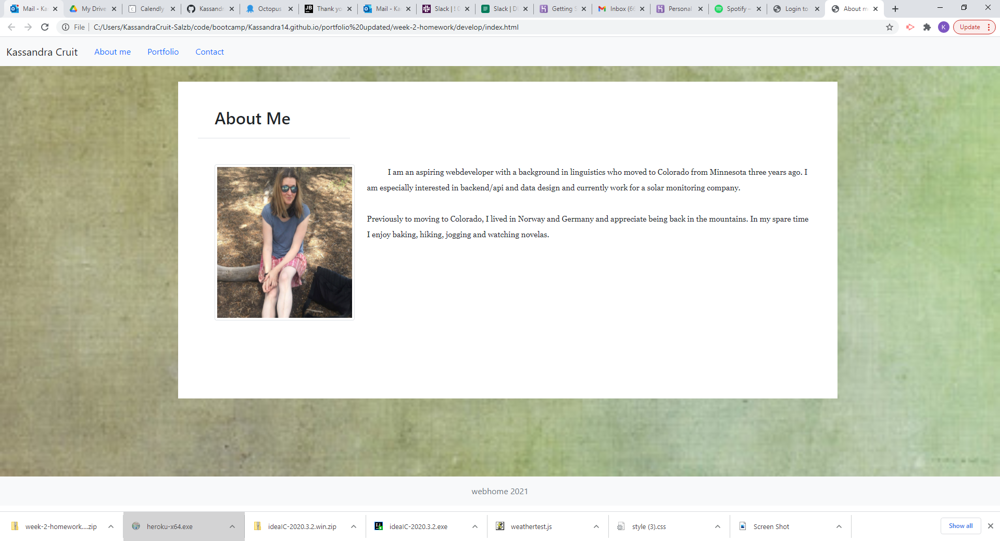

Responsive Portfolio

This assignment is designed as a place to show my web development progress and improving skills.  I am still at a rudimentary coding level but hoping to expand on this and this portfolio will gradually reflect this.

The portfolio has a home page with brief bio, portfolio page showing screenshots of some assignments ( i still need to update a couple projects so have not yet included their photos) as well as a contact page.

The page is designed to be render responsively in all web reading formats, mobile, tablet, multiple screensizes.

To go to this website click here:   https://kassandra14.github.io/Updated-Portfolio/develop/index.html

